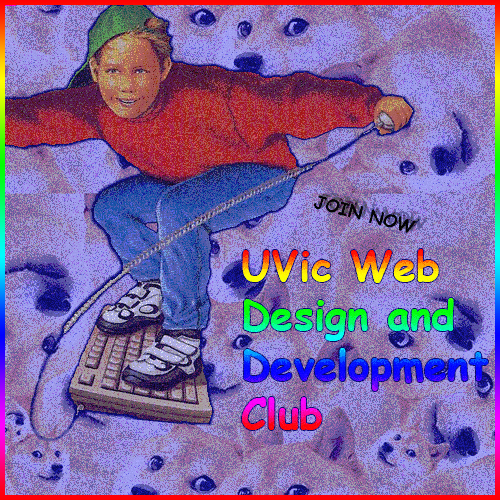

#### how-to-webdev

# Register with UVSS

**Before the beginning of every semester you wish to be active**, make sure you understand all of the deadlines for below items so you can complete them on time:

- [Register as a returning club](https://uvss.ca/student-groups/clubs/registration-resources/returning-club/), here's some info that will come in handy:
    * [Club Constitution](club-admin/constitution2016.pdf)
    * [Club Description](club-admin/club-description.txt)

- [Attend the first club council meeting of the semester](https://uvss.ca/student-groups/clubs/)

- [Book a room](http://www.uvic.ca/registrar/students/services/index.php)
   * *If you have a faculty member that can book a room for you before you are ratified, you have a better chance of booking (rooms in ECS book up very quickly)*
   * *Bob Wright Building is a nice back-up plan (nicish projectors, lots of outlets, nicer building, etc)*

