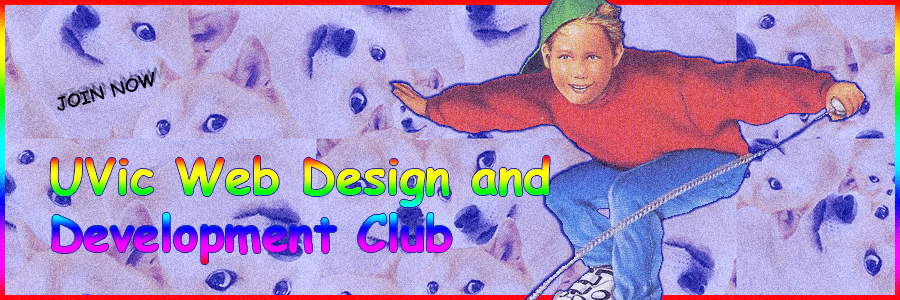

# Register with UVSS

**Before the beginning of every semester you wish to be active**, make sure you understand all of the deadlines for below items so you can complete them on time:

- [Register as a returning club](https://uvss.ca/student-groups/clubs/registration-resources/returning-club/), here's some info that will come in handy:
    * [Club Constitution](club-admin/constitution2016.pdf)
    * [Club Description](club-admin/club-description.txt)

- [Attend the first Clubs Council meeting of the semester](https://uvss.ca/clubs/)
   * Find out how to reserve a table for clubs day (try to get one by an outlet)

- [Book a room](http://www.uvic.ca/registrar/students/services/index.php)
   * *If you have a faculty member that can book a room for you before you are ratified, you have a better chance of booking (rooms in ECS book up very quickly)*
   * *Bob Wright Building is a nice back-up plan (nicish projectors, lots of outlets, nicer building, etc)*

# Clubs Day

Clubs and Course Union days are usually around the 2nd or 3rd week of the begginning of each semester.

- Find peeps to man the booth
- Prepare some [swaggy posters](clubs-day-posters) to hang up
- You're rockin if you manage some tasty/fun table incentives (candy, stickers, etc)

# The Social Medias

- [Facebook group](https://www.facebook.com/groups/UVic.io/) (post everything here much users)
- [Facebook account](https://www.facebook.com/Uvicaccount) (post on group from account)
- [Slack group](https://webdevclub.slack.com/messages) (great for organizing events and sharing memes)
- [Club landing page design](https://github.com/uvicwebdev/club-landing) (nice to have on easy to say domain name when recruiting potential members in conversation)
- [Twitter](https://twitter.com/uvicwebdev) (the hype account)

